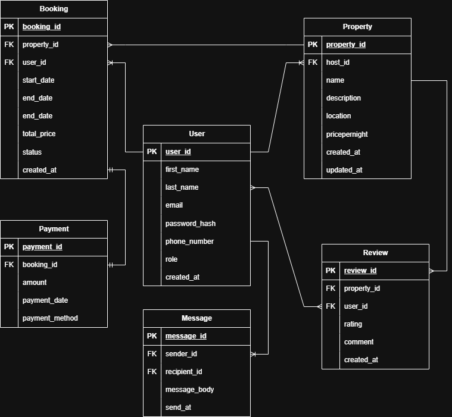

## User To Property
- Relationship: One-to-Many
- Description: A single User (with role host) can own multiple Properties, but each Property belongs to exactly one User.
## User To Booking
- Relationship: One-to-Many
- Description: A User (with role guest) can make multiple Bookings, but each Booking is made by exactly one User.
## Property To Booking
- Relationship: One-to-Many
- Description: A single Property can have multiple Bookings, but each Booking is linked to exactly one Property.
## Booking To Payment
- Relationship: One-to-One
- Description: Each Booking has a single Payment. Each Payment corresponds to exactly one Booking.
## User To Review
- Relationship: One-to-Many
- Description: A User can write multiple Reviews, but each Review is written by a single User.
## Property To Review
- Relationship: One-to-Many
- Description: A Property can receive multiple Reviews, but each Review is associated with a single Property.
## User To Message
- Relationship: Many-to-Many (Self-Referential)
- Description: A User can send messages to and receive messages from other Users. Each Message records the sender and recipient.